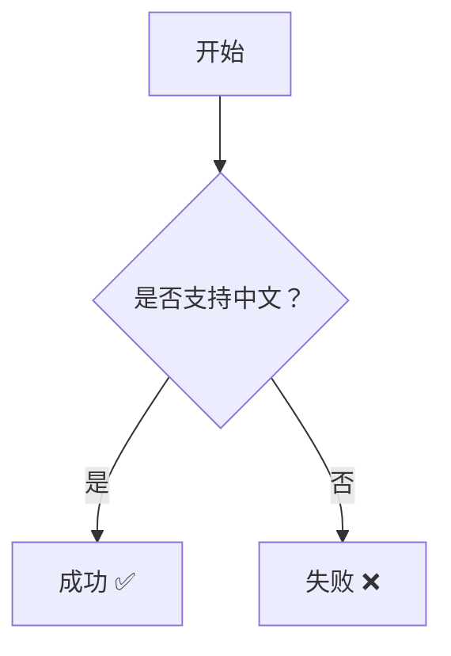
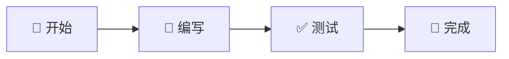
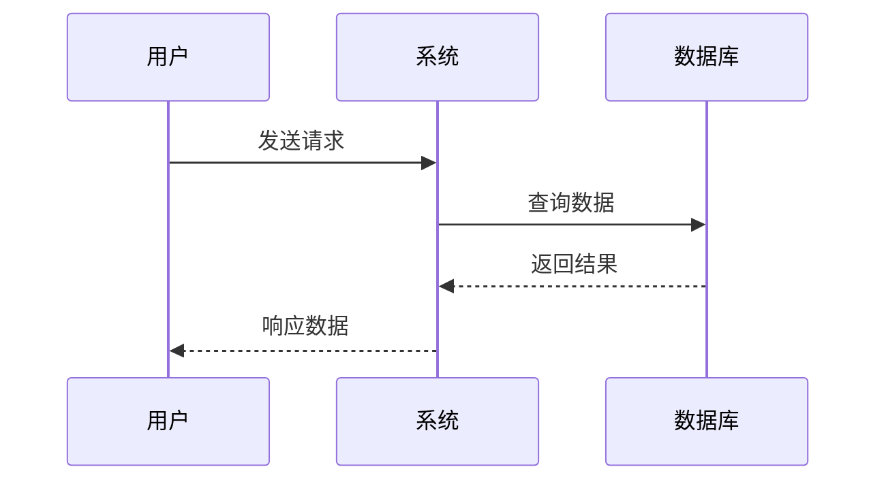

# MrDoc Mermaid 升级方案

## 问题描述
当前MrDoc中的Mermaid图表渲染存在以下问题：
- 不支持emoji表情
- 不支持中文字符
- 可能是由于使用的Mermaid版本较旧

## 升级目标
升级到Mermaid v10.4.0或更高版本，以获得：
- 完整的emoji支持
- 更好的UTF-8和中文字符支持
- 最新的图表功能和bug修复

## 当前状态分析

### 1. 文件结构
```
/static/mr-marked/
├── mermaid/
│   └── mermaid.min.js  (当前版本文件)
├── marked.min.js       (marked解析器)
└── marked.css          (样式文件)
```

### 2. 引用方式
- 通过`marked.min.js`处理Markdown中的mermaid代码块
- 动态加载`mermaid.min.js`进行图表渲染

## 升级方案

### 方案一：直接替换（推荐）

#### 步骤：
1. **下载新版本Mermaid**
   ```bash
   # 下载最新版本 (v10.9.0+)
   cd /Volumes/DataDisk/CodeSpace/kt/mrdocs/static/mr-marked/mermaid
   curl -o mermaid.min.js https://cdn.jsdelivr.net/npm/mermaid@10.9.0/dist/mermaid.min.js
   ```

2. **验证文件完整性**
   ```bash
   # 检查文件大小和内容
   ls -lah mermaid.min.js
   head -n 5 mermaid.min.js
   ```

3. **更新初始化配置**
   需要检查并更新mermaid的初始化配置，新版本可能需要调整：
   ```javascript
   mermaid.initialize({
     startOnLoad: true,
     theme: 'default',
     themeVariables: {
       primaryColor: '#fff',
       primaryTextColor: '#000',
       primaryBorderColor: '#7C0000',
       lineColor: '#F8B229',
       secondaryColor: '#006100',
       tertiaryColor: '#fff'
     },
     flowchart: {
       useMaxWidth: true,
       htmlLabels: true,
       curve: 'basis'
     },
     securityLevel: 'loose', // 允许更多HTML内容
     fontFamily: '"微软雅黑", "Microsoft YaHei", Arial, sans-serif' // 中文字体支持
   });
   ```

### 方案二：使用CDN（备选）

#### 步骤：
1. **修改marked.min.js中的引用**
   将本地引用改为CDN引用：
   ```javascript
   // 原来的本地引用
   script.src = cdn + 'mermaid/mermaid.min.js';

   // 改为CDN引用
   script.src = 'https://cdn.jsdelivr.net/npm/mermaid@10.9.0/dist/mermaid.min.js';
   ```

2. **添加版本锁定**
   确保使用固定版本，避免自动升级带来的兼容性问题

### 方案三：NPM管理（长期维护）

#### 步骤：
1. **初始化NPM项目**
   ```bash
   cd /Volumes/DataDisk/CodeSpace/kt/mrdocs
   npm init -y
   ```

2. **安装Mermaid**
   ```bash
   npm install mermaid@10.9.0
   ```

3. **构建脚本**
   创建构建脚本将依赖复制到static目录

## 兼容性处理

### 1. API变更适配
新版本Mermaid可能有API变更，需要检查：
- `mermaid.init()` → `mermaid.run()` (v9+)
- `mermaid.initialize()` 配置项变化
- 渲染回调函数签名变化

### 2. 中文和Emoji支持配置
```javascript
// 确保正确的字符编码
mermaid.initialize({
  securityLevel: 'loose',
  theme: 'default',
  fontFamily: 'system-ui, -apple-system, "Segoe UI", Roboto, "Helvetica Neue", "Noto Sans", "Liberation Sans", Arial, sans-serif, "Apple Color Emoji", "Segoe UI Emoji", "Segoe UI Symbol", "Noto Color Emoji"'
});
```

### 3. 样式调整
```css
/* 添加到marked.css */
.mermaid {
  font-family: system-ui, -apple-system, "微软雅黑", "Microsoft YaHei", sans-serif;
}

.mermaid text {
  fill: #333;
  font-size: 14px;
}

/* 支持emoji显示 */
.mermaid .nodeLabel {
  line-height: 1.5;
}
```

## 测试用例

### 1. 基础功能测试


### 2. Emoji测试


### 3. 复杂中文测试


## 回滚方案
如果升级后出现问题，可以快速回滚：

1. **备份当前版本**
   ```bash
   cp mermaid.min.js mermaid.min.js.backup
   ```

2. **恢复备份**
   ```bash
   cp mermaid.min.js.backup mermaid.min.js
   ```

## 部署步骤

1. **本地测试**
   - 在开发环境完成升级
   - 运行所有测试用例
   - 验证现有文档的mermaid图表

2. **生产部署**
   - 备份现有版本
   - 部署新版本
   - 清除浏览器缓存
   - 验证功能

3. **监控**
   - 观察错误日志
   - 收集用户反馈
   - 准备回滚

## 注意事项

1. **缓存清理**
   - 更新后需要清理浏览器缓存
   - 可以通过添加版本号参数强制更新：`mermaid.min.js?v=10.9.0`

2. **性能考虑**
   - 新版本文件可能更大，注意加载性能
   - 考虑使用gzip压缩

3. **安全性**
   - 设置合适的`securityLevel`
   - 避免XSS攻击

## 预期效果
升级完成后，应该能够：
- ✅ 正确显示中文字符
- ✅ 支持emoji表情
- ✅ 保持与现有文档的兼容性
- ✅ 获得更好的渲染性能